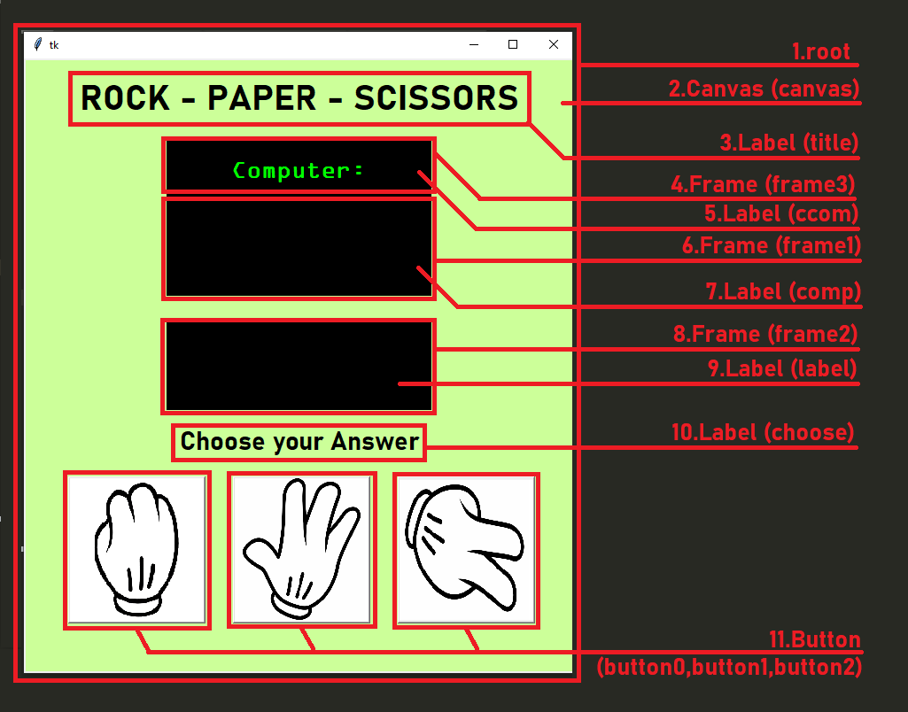

# Rock-Paper-Scissors-with-Tkinter
A GUI App, Rock-Paper-Scissors game, using Python Tkinter
####
My first year Computer Science group project about GUI.
####

####
## Implementing the logic
> let:
>
> 0 = rock
>
> 1 = paper
>
> 2 = scissors

The logic I use in this Rock-Paper-Scissors App is to random a number between 0 to 2 (to be the Computer answer)
```
com = random.randint(0,2)
```
And compare between what Player and Computer answer
```
if player == com:	  	        # Player and Com answer the same
  print("DRAW")
  result = "DRAW"
elif player == 2 and com == 1:		# Player : Scissors, Com : Paper
  print("WIN")
  result = " YOU WIN !"
elif player == 1 and com == 0:		# Player : Paper, Com : Rock
  print("WIN")
  result = "YOU WIN !"
elif player == 0 and com == 2:		# Player : Rock, Com : Scissors
  print("WIN")
  result = "YOU WIN !"
else:
  print("LOSE")
  result = "YOU LOSE !"
```
###
> Further Readings
>
> https://blog.resellerclub.com/the-6-best-python-gui-frameworks-for-developers/
>
> https://medium.com/@62050231/9d50d6b08ecd (in Thai)

